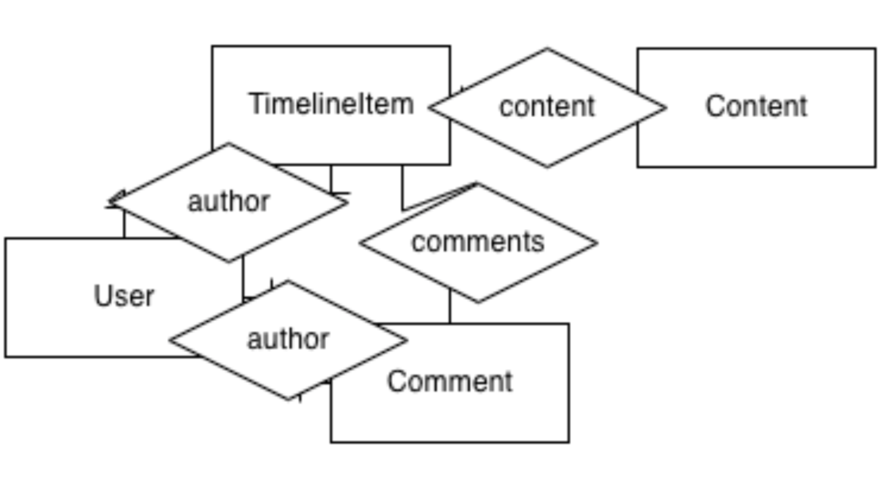
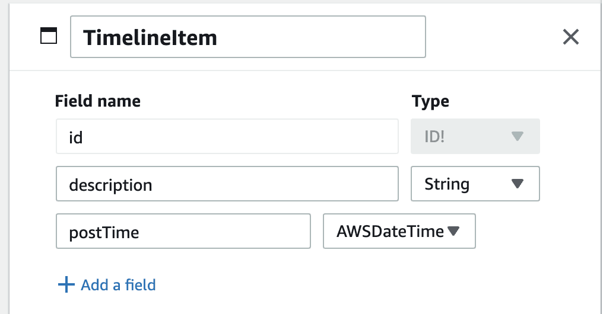
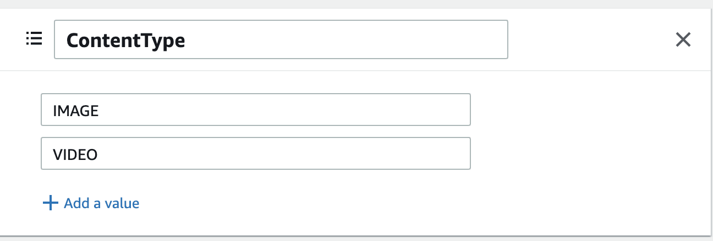
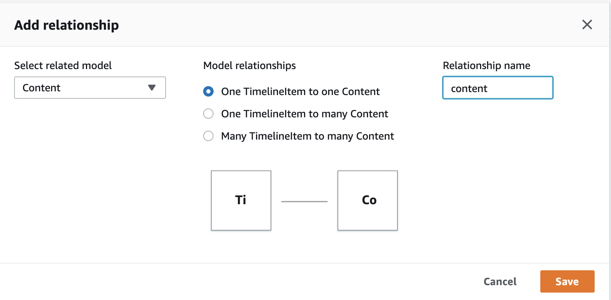
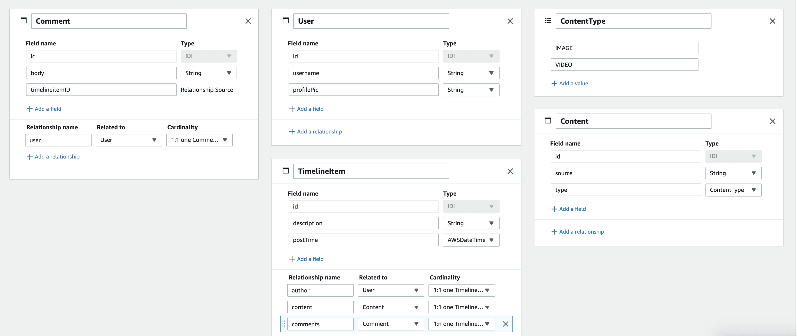
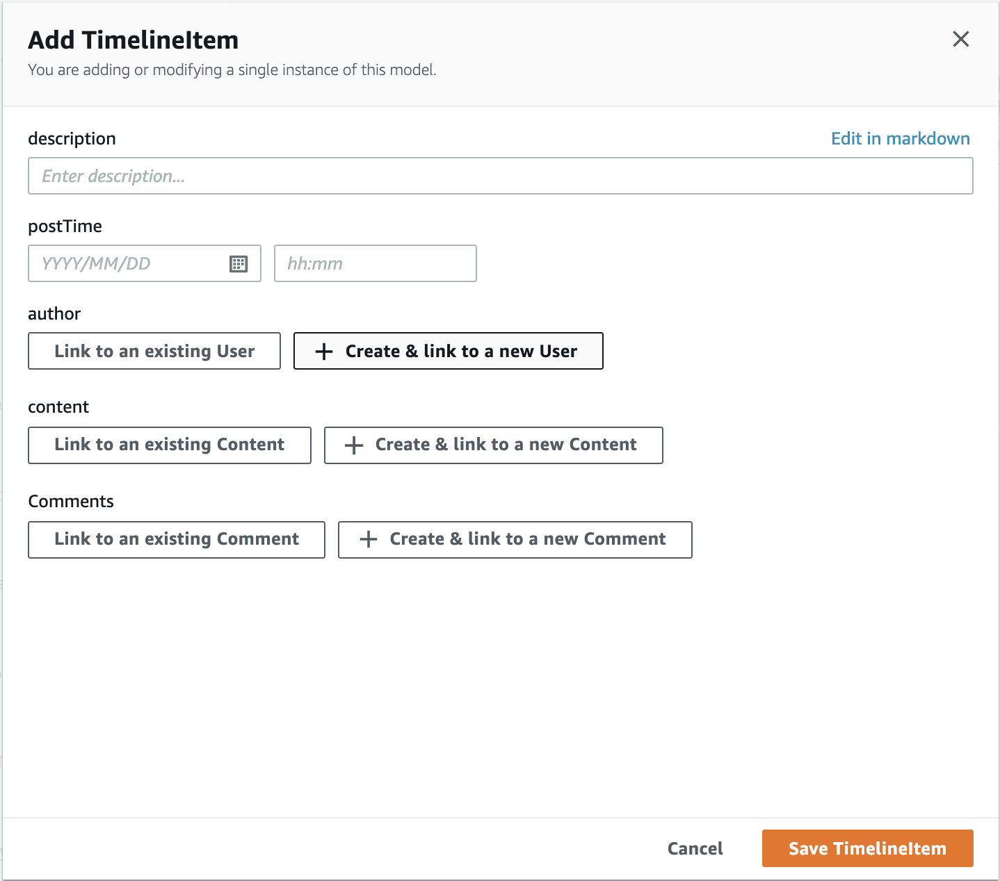

# AWS Amplify Fullstack Workshop

Welcome! Today we're going to build a fullstack cloud application with AWS Amplify. We'll integrate data, file storage, authentication and authorization, and more.

We'll create an Instagram-like app for sharing pictures!


## Icebreaker

- Introduce yourself in the form of a tweet! Use 280 or less characters to introduce yourself in the Zoom chat.
- Put an emoji in the chat that describes your comfort with React
- Put an emoji in the chat that describes your comfort with backend development
- Put an emoji in the chat that describes your comfort with AWS

## Learning objectives

- Explain the benefits of the cloud
- Create a fullstack app with AWS Amplify
- Add authentication, data storage, and file storage to your app on both the front and backend.

## What is the Cloud?

The cloud allows you to access computer resources on-demand. You may have used Google Drive or iCloud to store your files online rather than your own computer or phone wo that you have more storage space. This is a perfect example of how the cloud is used.

Many companies also use the cloud for their server infrastructure. You've probably heard of servers before, they're essentially computers that send information to other computers. We use them to handle the request/response cycle for websites -- they take a request and based on it handle business logic, database queries, etc. and then send a response back to the client.

In comes data centers -- these would hold all the needed servers for a company, and you'd buy more and more servers as the company grows. You'd have staff to manage the data center and you'd need to install software on and maintain the servers yourself.

The cloud allows you to access the provider's servers and use them instead of needing to manage the data centers yourself. This provides a lot of benefits to the company, first you only need to pay for what you use instead of all the servers you buy for a data center. You also have global availability with most cloud providers, you don't need to have data centers all over the world to speed up your response time globally -- the cloud provider does that for you. And, you don't need to pay for the data centers or data center staff yourself, instead that's done by the cloud provider. AWS has a [whitepaper](https://docs.aws.amazon.com/whitepapers/latest/aws-overview/six-advantages-of-cloud-computing.html) explaining these benefits in further detail.

There are different families of cloud services.

- Infrastructure as a service (IaaS) is the lowest level where you have more control over the operating system and runtime for your services. Examples include Amazon EC2 and Digital Ocean. 
- Platform as a service (PaaS) - provides cloud components where you manage the application logic and data but not the servers or anything low level. Examples include Heroku and AWS Elastic Beanstock.
- Software as a service (SaaS) - cloud services an end user directly uses with no cloud management needed. Some examples include Dropbox, iCloud, and Slack.
- Function as a service (FaaS) - allows you to deploy just a function into the cloud, you don't need to do server management or anything like that. AWS Lambda is a great example of this.

AWS, or Amazon Web Services, is a cloud provider (and my employer) who has over 200 different cloud services. We'll be chatting about a bunch of these services throughout this workshop.

## What is Amplify?

AWS Amplify is a set of tools and services to help frontend web and mobile developers to build full-stack applications on AWS. Amplify helps developers to create backend resources such as file storage, authentication, and data storage using either a visual Admin UI interface or the command line, and then deploy these resources to the cloud. Then, developers can connect their frontend to these backend resources that they created or existing AWS resources using the Amplify libraries. These libraries support web frameworks including JavaScript, React, Angular, Vue, Next.js, and mobile platforms including Android, iOS, React Native, Ionic, and Flutter. You can also deploy static web apps in a few clicks and manage your app’s content using Amplify’s tooling. You can either use Amplify’s tools independently as needed or use them all together.

## Create an AWS Account

Follow the instructions at aws.amazon.com to create an AWS account. Enter your information including a billing account. Make sure to read and accept the AWS customer agreement and verify your phone number!

### Billing

[Here](https://aws.amazon.com/free/) is a page about the AWS free tier, which will allow you to use a service for free for either a year or always under a certain amount. We'll also set up a billing alarm so that you'll get notified if your estimated charges reach a certain limit that you specify.

1. Open the [Billing and Cost Management console](https://console.aws.amazon.com/billing/) 
2. In the navigation pane, choose Billing Preferences, then choose Receive Billing Alerts. Then, choose save preferences.
3. Now, navigate to cloud watch. 
4. Then click on alarms. Click Create alarms. 
5. Then, select metric, and choose a billing total estimated charge. Choose the amount that you want to set an alarm for, for example, mine is $10. So, if my AWS billing for the month goes over $10 I get an email. 

## Data Modeling

Data modeling is when you work define the pieces of data that you need for your app as well as the relationships between data. You could model data to represent anything - for example a library may have rows, books, and librarians each with data associated with them. Rows would have books that belong to them, and librarians may have favorite books. 

Normally, you'll have models and attributes. Models are types of data (Book, Library), attributes are pieces of data associated with them. You may see diagrams called ERDs, or entity relational diagrams, that display relationships between data, for example: 



The Amplify Admin UI allows you to create a data model with a visual interface.

First, let’s create a schema for our data. You can access the Admin UI via [this link](https://sandbox.amplifyapp.com/getting-started). When we do this, we’re creating a backend that utilizes AWS Amplify DataStore. This automatically enables your data to be both online and offline, which is especially handy for mobile developers. Under the hood it also uses GraphQL, which we'll dive into in a little bit.

On the home page, click “Get started” under “Create an app backend”.


Click the add button, then “add model”.

The first model we’ll create will be a `TimeLineItem`. This will have a description, which will be a String, and a postTime which will be an AWSDateTime.



This will have a 1:1 relationship with the content, so each `TimelineItem` will have one `Content` instance associated with it that stores the actual link to the video or image.

Before we create that, we’ll create an Enum. This will have the values `IMAGE` and `VIDEO` — we’ll store on the Content what type of content the `TimelineItem` will render. Click the add button again, but this time select Enum. Then add the two possible values!



Now, we’ll create our `Content` model — click add again and select add model. This model will have `source` which is a string that will link to the image or video content. Then there will be a `type` which will be the ContentType enum — it should show up in the dropdown if you scroll to the bottom!

Now, we’ll create a relationship between the TimelineItem and Content. Under the TimelineItem, click “add a relationship”. Then, select the Content model and select “one TimelineItem to one Content”. You can also change the relationship name – I normally set mine to all lowercase.



### Your Turn: Add a Comment and User model

1. Create a Comment model with the following field:
   - body (string)
2. Create a User with the following fields:
   - username (string)
   - profilePic (string)

Now add relationships:

- Add a 1:1 relationship to the Comment model to User
- Add a 1:1 relationship between TimeLine model to User
- Add a 1:n relationship between TimelineItem to Comments

<details>
<summary>Completed Schema</summary>

</details>

### Test Locally

Now, let's test out the backend we generated locally.

First, we'll create a React app:

```sh
npx create-react-app renderatl-workshop
cd renderatl-workshop
```

Then, install the Amplify CLI:

```sh
curl -sL https://aws-amplify.github.io/amplify-cli/install | bash && $SHELL
```

Pull your app to your local environment:

```sh
amplify pull --sandboxId your-sandbox-id
```

Install the needed dependencies:

```sh
npm install aws-amplify typescript
```

Note that at this point you have nothing deployed to the cloud! You're just working locally -- you don't even need to have an AWS account until we deploy our app.

Go ahead and open the project up in your text editor, let's see what was created.

There's one file in particular I want to talk about -- schema.gql. Under the hood, we're going to be using GraphQL for our app.

### What is GraphQL?

According to its documentation, "GraphQL is a query language for your API, and a server-side runtime for executing queries using a type system you define for your data." GraphQL itself is a specification, meaning that there's a document outlining what GraphQL queries look like and how client-server interaction works with it; however, it can be used with any programming language or data layer for your app.

In practice, this allows frontend developers to send queries asking for the data they need -- including nested data -- to the backend. This allows backend developers to create one endpoint instead of the many needed for a REST API. You can send mutations to change data and queries to retrieve data all to one place.

#### Why use GraphQL?

There are a lot of reasons why GraphQL is popular. The first is that it simplifies the communication between frontend and backend developers much less difficult -- instead of frontend developers needing to ask for a new endpoint once their requirements change, they can instead just update their GraphQL query. This becomes even more helpful if you have multiple frontends requiring the same backend data. Frontend developers can get exactly the data they need -- no under or over fetching of fields or items.

Since frontend developers can request nested data using one query, network requests are also minimized -- for example if you query for a blog post, you can also get that post's comments in that one query instead of doing a second request to get them. This also may reduce the amount of frontend code needed and make that code easier to understand.

GraphQL also enforces a typed data schema, so each item's fields will have to match those types. This makes data more consistent and manageable -- instead of having to loop through blog posts and figure out if each title is a string or a boolean, GraphQL will enforce that each title is a string.

#### When is GraphQL not so good?

As with anything in software engineering, there are also drawbacks to using GraphQL. Firstly, I started using GraphQL way back when it came out in around 2015, and I hated it. I was a fullstack engineer on a small team, and building the backend was more work and the frontend needed to be more verbose. GraphQL queries are often long, whereas with many REST APIs you can just provide a url. In addition, many backend frameworks and languages have much less mature support for GraphQL APIs compared to REST. You may have to do more work and navigate through a less used library to get your GraphQL Api. If you're the one creating the endpoints and consuming them, building a REST API may be quicker -- especially if you're using a programming language or framework with less mature GraphQL support.

GraphQL shines with larger teams where a frontend team is developing the client side and a separate team is developing the server. In addition, there have been more and more managed GraphQL services, like Hasura and AWS AppSync. These allow you to generate a GraphQL backend using their services and then consume it on the frontend -- this usually speeds up the rate of backend development considerably when compared to writing a GraphQL server from scratch.

Finally, many developers are taught how to use and create a REST API from early on in their careers and may have less institutional knowledge around GraphQL. Getting a full team up to speed may be an investment that you need to consider.

### Connect to Amplify

We’ll need to configure Amplify for our project. Open up your src/index.js file and add the following:

```js
import Amplify from 'aws-amplify'
import awsconfig from './aws-exports'

Amplify.configure(awsconfig)
```

### Create Data

Let's create a `User`. Go to your App.js and add the following to your return: 

```js
<button onClick={createUser}>Create User</button>
```

Then add the following function:

```js
import { DataStore } from '@aws-amplify/datastore'
import { User } from './models'

...

const createUser = async () => {
   const newUser = await DataStore.save(new User({
      username: prompt('username'),
      profilePic: prompt('profilePic')
   }))
}
```

Test it out!

### Fetch Data
Let's also make it so that when you load the page, you fetch all users.

```js
import { useEffect } from 'react'
...
useEffect(() => {
   const pullData = async () => {
      const models = await DataStore.query(User)
      console.log(models)
   }
   pullData()
})
```

### Online/Offline Data

I mentioned this earlier, but our data is currently all local -- nothing is syncing to a database. Amplify DataStore handles this offline scenario for us -- but it will also handle online data. In some scenarios offline data is incredibly important -- systems data loss is devastating.

When you have distributed data, the CAP theorem comes into play, which states that a system can only have two out of the three: partition tolerance, consistency, and availability. Partition tolerance means that a system continues to run if there are outages, availability means that every request gets a response on success or failure, and consistency means that all replications have the same data at the same time. For an app with a frontend, partition tolerance is a necessity: you have one server and a client or two partitions at the very minimum. We also have already stated that we want our data available online and offline. So, full consistency is the branch sacrificed and "eventual consistency" is enacted instead.


#### AWS Amplify DataStore

DataStore stores data both in IndexedDB and DynamoDB with no extra work from us.

LocalStorage’s API is developer-friendly, in large part because it’s synchronous, and it saves data across browser sessions. So the user has one draft stored per device, which is great for simple use cases, but it becomes very complex very fast if the user updates data via another device -- which version of the data loads for them? The offline/online data problem is more complex than initially one might think: you're essentially creating a distributed system. You're using localStorage for some data and your database for the rest of it. Also, there are limits to how much data localStorage can store and its synchronicity blocks the main thread.

With our data, when the user goes offline, there will be different local and global data until the user goes back online. It's local first which means when you run a query or mutation on data you'll first update data in IndexedDB, the default DataStore on-device storage engine. It's similar to localStorage but allows for much more data and asynchronous updating in exchange for a more complex API, which we won’t need to worry about since we are using DataStore to abstract it away. Then, if you enable online storage your data will sync to your AWS database of choice, which defaults to DynamoDB.

### Amazon DynamoDB

Amazon DynamoDB is a serverless key-value and document database that's highly scalable. Let's step back and talk about what that means.

#### Scaling

There are two types of scaling when it comes to servers and databases: horizontal and vertical. Horizontal scaling means adding more database servers, vertical scaling means adding more to existing servers. 

### SQL vs. NoSQL

SQL stands for Structured Query Language -- these are relational databases where you use something called "joins" to match data up to related data. SQL is great because it's standardized and the modeling often relates to the way we think of data in the real world. You can vertically scale a SQL database; however there's a limit to vertical scaling. Horizontal scaling is more difficult here.


NoSQL stands for not just SQL -- these are all the other databases that don't fall under the SQL family. NoSQL databases are often able to scale horizontally, which means that these are typically used at hyperscale. 

#### Types of NoSQL Databases

There are different types of NoSQL databases.

**Key-Value Stores** - Each item is stored with a key and a value, similar to a JavaScript object. Redis is a popular key-value store.
**Graph Stores** - These focus on relationships between data. Neo4j is a popular Graph database.
**Column Stores** - These focus on data stored in columns rather than rows. These are great if you need to run a lot of analytics on your data. Cassandra is a popular column store.
**Document Stores** - These store data in JSON, BSON, or XML. MongoDB is a popular document store.

### Serverless vs. Serverful

Serverless services handle scaling and server-management for you. So instead of having to tell your database or server to scale, it does so for you. There are different types of serverless, and we'll dive into them later on when we talk about AWS Lambda. For now, all you need to know is that DynamoDB scales for you, you don't need to add more servers or add GBs of storage manually.

## 15 minute break!

## Backend Deployment

Now, let's deploy our app backend. Go back to the Amplify Sandbox tab in your browser, then go to the "Deploy" tab.

On the next page, choose a name for your app like "RenderATLworkshop" and then choose an AWS region. It’ll take a few minutes for your app to deploy. Once it does, click the “Backend environments” tab and then “Open admin UI”. On this page, you’ll be able to update your deployed data, add authentication, and manage your content.

### Your Turn: Add Data via the Data Explorer

Within the Admin UI, head to the content tab. You’ll be able to create data within here for the app. Create a couple instances of each model and connect the data together. We’ll use this as our test data for the Instacard project! You can start from the `TimelineItem` and then create your associated `User`, `Content`, and `Comments`. For the images, use a link to an image from anywhere you want, I like the ones on [Unsplash](https://unsplash.com/).



Change your Amplify id to the production app by running the "Amplify pull" command you get under "local setup instructions" in the Admin UI.

### Add Chakra UI to the Project

```sh
npm i @chakra-ui/react @emotion/react@^11 @emotion/styled@^11 framer-motion@^4 @chakra-ui/icons
```

Then, set Chakra up for your project:
```js
// App.js
import { ChakraProvider } from '@chakra-ui/react'
...

return (
  <ChakraProvider>
    ...
  </ChakraProvider>
)

```

### Your Turn: Create the React App

**Don't peek at the solution code until you've tried it yourself!**

Create three new components:

```
touch src/{Timeline,Card,CommentList}.js
```

#### Timeline.js Component

First create the `Timeline.js` component. This should query to get all of the `TimelineItem`s. No need to display them for now.

<details>
<summary>Timeline.js Solution</summary>

```js
// Timeline.js
import { useState, useEffect } from 'react'
import { DataStore } from '@aws-amplify/datastore'

import { TimelineItem } from './models'

export function Timeline () {
  const [timeline, setTimeline] = useState([])

  useEffect(() => {
    const getTimeline = async () => {
      const timelineData = await DataStore.query(TimelineItem)
      setTimeline(timelineData)
    }

    getTimeline()
  }, [])

  return(
    <div ></div>
  )
}
```

</details>

1. Import the `Container` component from Chakra.
2. Inside the return add an instance of the `Container`.
3. Inside the `Container` map through your timeline items.
4. Make the component receive `props`.
5. Make the `.map` return `props.children({ post })` for each post.

<details>
<summary>Timeline rendering</summary>

```diff
// Timeline.js
import { useState, useEffect } from 'react'
import { DataStore } from '@aws-amplify/datastore'
+ import { Container } from '@chakra-ui/react'

import { TimelineItem } from './models'

+ export function Timeline ({ children }) {
  const [timeline, setTimeline] = useState([])

  useEffect(() => {
    const getTimeline = async () => {
      const timelineData = await DataStore.query(TimelineItem)
      setTimeline(timelineData)
    }

    getTimeline()
  }, [])

  return (
+    <Container>
+      {timeline.map(post => children({ post }))}
+    </Container>
  )
}
```
</details>
 - you do: pull other data, create real forms

#### Card.js Component

Now, we’ll create a Card component. I’ll go ahead and import everything I’m going to eventually need from Chakra just so I don’t need to keep coming back to the imports.

```js
// Card.js
import { Box, Image, Flex, Avatar, Text, Spacer, IconButton } from '@chakra-ui/react'
import { ChatIcon, AddIcon, EmailIcon } from '@chakra-ui/icons'
```

Then, I’ll create my starter component. This component will start off with a box that renders “Hello!”. It’ll eventually take child elements, but let’s first wire up our <Timeline> component to render a <Card /> for each TimelineItem.

```js
export function Card ({ children }) {
  return (
    <Box maxW='lg' borderWidth='1px' borderRadius='md' overflow='hidden' m={5}>
      <h1>Hello!</h1>
    </Box>
  )
}
```

Now, we’ll go back to our <App > component and render our timeline of cards! I’ll need to import the necessary components, and then inside the <Timeline> instance, we’ll add a function that returns a <Card> instance. The .map in the timeline will loop through all the posts and run this function to render a <Card> for each post!

```js
//App.js
import { ChakraProvider } from '@chakra-ui/react'

import { Timeline } from './Timeline'
import { Card } from './Card'

export default function App () {
  return (
    <ChakraProvider>
      <Timeline>
        {({ post }) => (
          <Card key={post.id}></Card>
        )}
      </Timeline>
    </ChakraProvider>
  )
}
```

Now that we have “Hello!” showing up in a box for each TimelineItem we can proceed to render the actual card data. Each <Card> will have a Header, a Main, and a Footer. These will all be components, but we’ll create them and export them under the Card component since we’ll use them all in tandem. First, let’s create the <Card.Header />. This will need to take the author of the post, so we’ll take that as a prop. Then we’ll render more Chakra Box and Flex components for aligning the items properly. We’ll also use the Avatar component to render the picture if there is one. We won’t actually create the menu dropdown in this tutorial, so we’ll just add three dots as a placeholder.

```js
// Card.js
Card.Header = function ({ author }) {
  return (
    <Box p={2}>
      <Flex>
        <Box d='flex' alignItems='center'>
          <Avatar name={author.username} src={author.profilePic} />
          <Box ml={2}>
            <Text fontWeight='bold' fontSize='sm'>
              {author.username}
            </Text>
          </Box>
        </Box>
        <Spacer />
        <Box p={2}>
          &hellip;
        </Box>
      </Flex>
    </Box>
  )
}
```

Then, we’ll create the <Card.Main> component which will render the video or image that the post contains. We’ll add a conditional for the type of content, and then render it.

```js
Card.Main = function ({ content }) {
  let cardContent
  if (content.type === 'VIDEO') {
    cardContent = (
      <video controls>
        <source src={content.source} />
      </video>
    )
  } else {
    cardContent = <Image src={content.source} />
  }
  return (
    <Box>
      {cardContent}
    </Box>
  )
}
```
Finally, the card footer will have three buttons that are just for display purposes in this tutorial. Then, we’ll add the caption below the image. We’ll also leave a slot for the comments, which will be a child component.

```js
Card.Footer = function ({ author, description, children }) {
  return (
    <Box ml={3}>
      <Box>
        <IconButton icon={<AddIcon />} variant='ghost' />
        <IconButton icon={<ChatIcon />} variant='ghost' />
        <IconButton icon={<EmailIcon />} variant='ghost' />
      </Box>
      <Box mt={3}>
        <Text>
          <Text as='b'>{author.username} </Text>{description}
        </Text>
      </Box>
      <Box>
        {children}
      </Box>
      <Box mt={1} mb={2}>
        <Text fontSize='xs' color='gray.500'>
          2 HOURS AGO
        </Text>
      </Box>
    </Box>
  )
}
```

### CommentList Component

Now create a component that will list out all the comments for a post. [Query to get the comments that belong to one post](https://docs.amplify.aws/lib/datastore/getting-started/q/platform/js/). Then, use a Chakra ui `Box` component at the top level, then `Text` components to show the different pieces of text for each comment.

<details><summary>solution</summary>

```js
import { useEffect, useState } from 'react'
import { DataStore } from '@aws-amplify/datastore'
import { Box, Text } from '@chakra-ui/react'

import { Comment } from './models'

export function CommentList ({ postId }) {
  const [comments, setComments] = useState([])
  useEffect(() => {
    const getComments = async () => {
      const postComments = await DataStore.query(Comment, p => p.timelineitemID === postId)
      setComments(postComments)
    }
    getComments()
  }, [])
  return (
    <Box>
      {comments.map(comment => (
        <Text key={comment.id}>
          <Text key={comment.id}>
            <Text as='b'>{comment.user.username} </Text>
            {comment.body}
          </Text>
        </Text>
      ))}
    </Box>
  )
}
```
</details>

Finally, let's render a card for each comment!

```js
import { ChakraProvider } from '@chakra-ui/react'

import { Timeline } from './Timeline'
import { Card } from './Card'
import { CommentList } from './CommentList'
import { CommentForm } from './CommentForm'

export default function App () {
  return (
    <ChakraProvider>
      <Timeline>
        {({ post }) => (
          <Card post={post} key={post.id}>
            <Card.Header author={post.author} />
            <Card.Main content={post.content} />
            <Card.Footer
              author={post.author}
              description={post.description}
            >
              <CommentList postId={post.id} />
            </Card.Footer>
            <CommentForm />
          </Card>
        )}
      </Timeline>
    </ChakraProvider>
  )
}
```

### Form for New TimelineItem

In a breakout room with a group, create a form that allows a user to create a new TimelineItem. For now, only allow them to input an image URL from the internet.

## Subscriptions for Dynamic Data

Whenever a new TimelineItem is created, we want to update our timeline to reflect that. With DataStore, we can subscribe to changes in data. Let's update our query:

```js
const subscription = DataStore.observe(TimelineItem).subscribe(msg => {
  console.log(items)
})

// Call unsubscribe to close the subscription
subscription.unsubscribe()
```

## Authentication

Let's now add authentication and authorization to our app. First, let's get on the same page about what they are:


**Authentication**: Make sure the person says they are who they claim to be

**Authorization**: Allow users to do certain things depending on their roles

### Amazon Cognito

Amazon Cognito lets you add user sign-up, sign-in, and access control to your web and mobile apps quickly and easily. You can enable 2FA and social auth as well.

Go to the Admin UI and then click on "Authentication" tab and configure auth. Go with the default options.

Then run Amplify pull to sync your changes locally.

Let's make it so that users have to sign in to view the home page, like real Instagram:

```sh
npm i '@aws-amplify/ui-react'
```
```js
// App.js
import { withAuthenticator } from '@aws-amplify/ui-react'

...
export default withAuthenticator(App)
```

You could also make this timeline public and only require sign in to view other pages or components!

## Authorization

Now let's add a few authorization rules. If you go to the `data` tab in the Admin UI you'll see some options for setting them up when you click into a model.

Let's make it so that `admin` users can `Read, Create, Update, Delete` TimelineItems, `anyone` can `Read` TimelineItems, and owners can `Read, Create, Update, Delete` posts they own. 

After deploying, re-run Amplify pull.

First, we'll need to update Amplify's configuration to allow for multi auth.

```js
//index.js
import Amplify, { AuthModeStrategyType } from 'aws-amplify'
import awsconfig from './aws-exports'

Amplify.configure({
  ...awsconfig,
  DataStore: {
    authModeStrategyType: AuthModeStrategyType.MULTI_AUTH
  }
})
```

In the `App` component, let's fetch the user and also create a flag to see if they're an admin.

```js
import { Auth } from 'aws-amplify'

...

const [isAdmin, setIsAdmin] = useState(false)
const [user, setUser] = useState({})

useEffect(() => {
  const getData = async () => {
    try {
      // fetch the current signed in user
      const user = await Auth.currentAuthenticatedUser()
      // check to see if they're a member of the admin user group
      setIsAdmin(user.signInUserSession.accessToken.payload['cognito:groups'].includes('admin'))
      setUser(user)
    } catch (err) {
      console.error(err)
    }
  }
  getData()
}, [])
```

Let's also add a sign out button to the top of the page:

```js
<button onClick={async () => await Auth.signOut()}>Sign Out</button> 
```

### Your Turn: Restrict Actions to Certain Users

- Add a `delete` button that only admins can see, make the delete button work!
- Add an edit form that only post owners can see (Hint: check out the .owner attribute). Implement that form logic!

## Storage

So, right now we're just using links to images hosted elsewhere on the internet. We should store them ourselves! We shouldn't do it in our database due to the file size, instead we'll store them in Amazon S3 which offers file storage. Then, we'll save a link to the image in our database.

```js
// save the file to the database
const file = await Storage.put(pic.name, pic)

const newUser = await DataStore.save(new Content({
  image: pic.name
}))

console.log(newUser)
```
Then we can use the `S3Image` component to display our image.

```js
<S3Image key={image.name}>
```

## User Profiles

AWS Lambda allows you to create serverless functions - functions that you can deploy without worrying about server configuration or scaling. You get charged for each function invocation rather than paying for a full server or part of a server. Most of the other services we've used are also serverless, such as DynamoDB, you don't need to worry about hosting or deploying it, that's done for you.

AWS Lambda follows an event driven architecture - so a user could navigate to an endpoint and that could trigger the function.

Or they can be triggered on a schedule, every hour for example.

In this case, we're going to trigger a new Lambda function call every time a new user is confirmed.

```sh
amplify update auth
```
We'll add a Lambda trigger for a post confirmation hook.

Now, we'll update the function to give it resource access permissions.
```sh
amplify update function
```
Give access to storage, data, and auth.

Then, change into the function's directory. We'll install the `aws-sdk`.

```sh
npm i aws-sdk
```
Now we'll write an event handler that adds a new  User to the database when a new Cognito user is created. 

```js
const aws = require('aws-sdk')
const ddb = new aws.DynamoDB()
 
exports.handler = async (event, context) => {
 const date = new Date()
 const params = {
   Item: {
     __typename: { S: 'Author' },
     id: { S: event.request.userAttributes.sub },
     name: { S: event.userName },
     profilePic: {
       S:
       'https://placekitten.com/640/360'
     },
     createdAt: { S: date.toISOString() },
     updatedAt: { S: date.toISOString() },
     _version: { N: '1' },
     _lastChangedAt: { N: `${date.getTime()}` }
 
   },
   TableName: process.env.TABLE_NAME
 }
 
 try {
   const item = await ddb.putItem(params).promise()
   console.log(item)
 } catch (err) {
   console.error(err)
 }
 
 context.done(null, event)
} 
```

Run `amplify push` to deploy your function.

### Your Turn: Update Image Form

Enable image storage for the user profile database item. Then make it so that a user can upload their own `profilePic`!

## Frontend Deployment

Now let's deploy our frontend. First, create a GitHub repo and push your code.

Then, go to the Amplify Console, and click "add a frontend" to your project. Then you can pretty much just click next a few times! Your frontend will deploy!

## Bonus: AI/ML

You can use Amplify predictions to add AI and ML to your app. For example if you wanted to predict what an image contains, for example, you could do the following:

```sh
amplify add predictions
-> identify
-> labels
```

Add the following JS code!

```js
import { AmazonAIPredictionsProvider } from '@aws-amplify/predictions'

Amplify.addPluggable(new AmazonAIPredictionsProvider());
```

```js
const prediction = await Predictions.identify({
labels: {
  source: {
    key: user.profilepic
  },
  type: 'LABELS' // 'UNSAFE'
}
})

console.log(prediction)      
```

You can try this out too:
```
amplify add predictions
-> identify
-> entities
```

```js
const prediction = await Predictions.identify({
entities: {
  source: {
    key: user.profilepic
  },
}
})

console.log(prediction)
```

Predictions comes with built-in support for Amazon Translate, Amazon Polly, Amazon Transcribe, Amazon Rekognition, Amazon Textract, and Amazon Comprehend. You can use this to translate or transcribe text, perform sentiment analysis, text to speech, and more!


## Bonus: Environments

Amplify has team workflows built in so that multiple people can work on a project at once. You can also have different amplify environments for your project, for example dev, prod, and test.

You've seen `amplify pull` and `amplify push` already in this workshop - you can run push to deploy resources to the cloud, and pull to pull those changes locally. The same works across users - a second developer could run amplify pull  to fetch upstream changes. Similar to Git!

Run `amplify env checkout ENVIRONMENT_NAME` to switch environments.

```sh
amplify env add prod
amplify push
amplify env list
```

## Bonus: Maps

Amplify just added support for maps through Amplify Geo, which is in developer preview. Try using [the docs](https://docs.amplify.aws/lib/geo/getting-started/q/platform/js/) to add a map to your app!

## Cleanup!

Thanks so much for building with me today! If you want to stay in touch, I'm @aspittel pretty much everywhere on social media. If you want to take this app down from your Amplify account, run `amplify delete` -- your code will remain but the cloud resources will be taken down.
